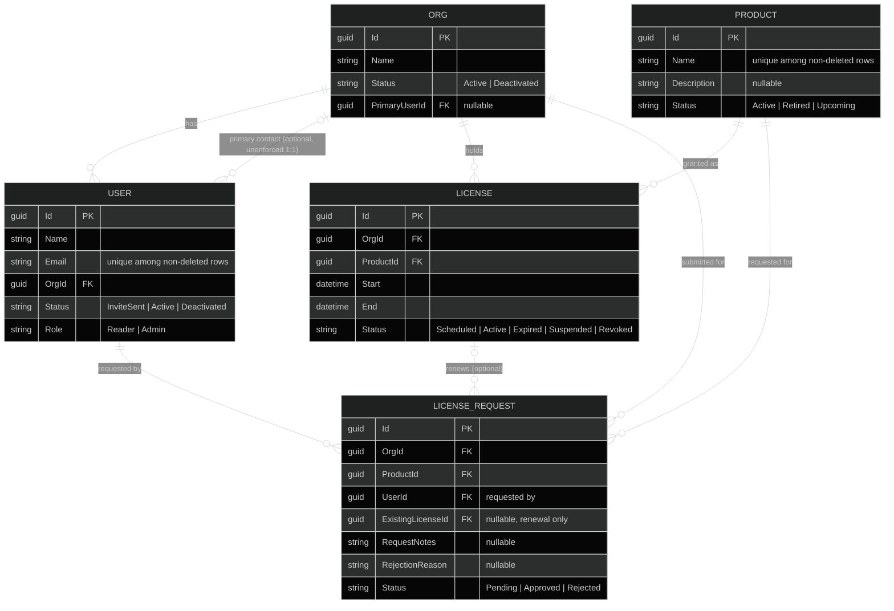
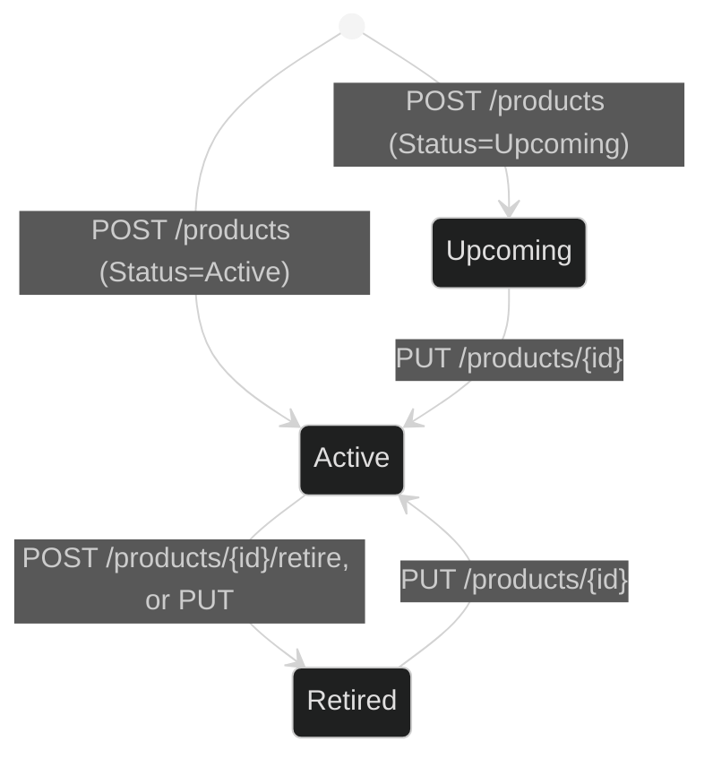
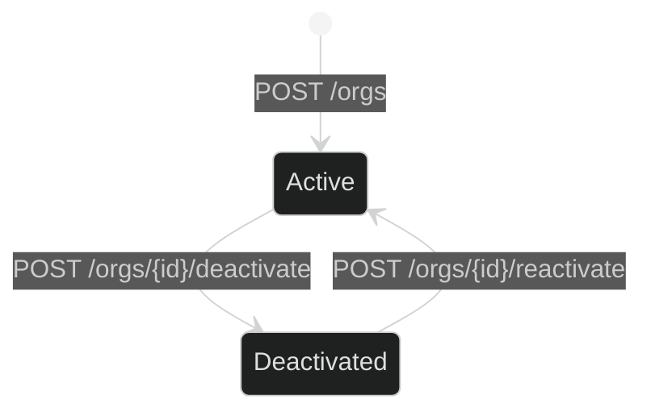
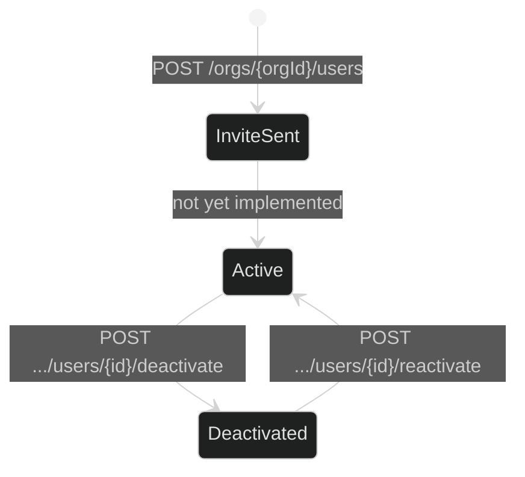
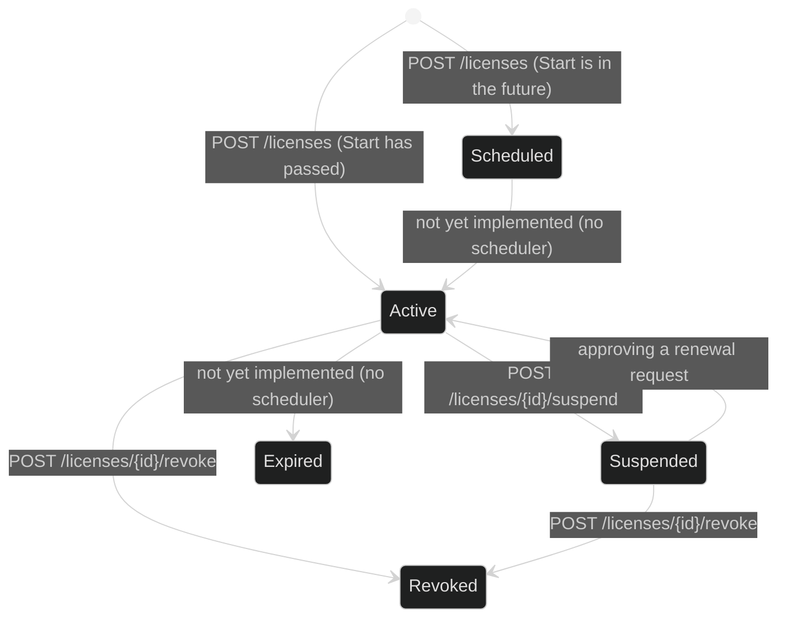
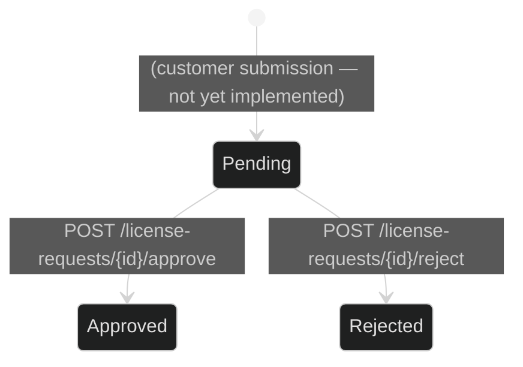
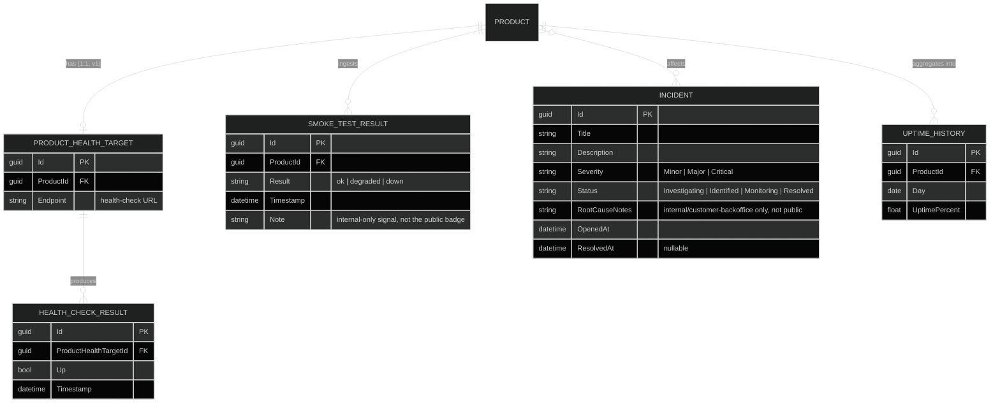
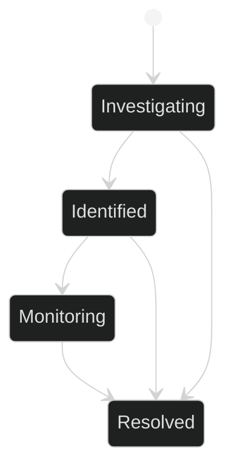
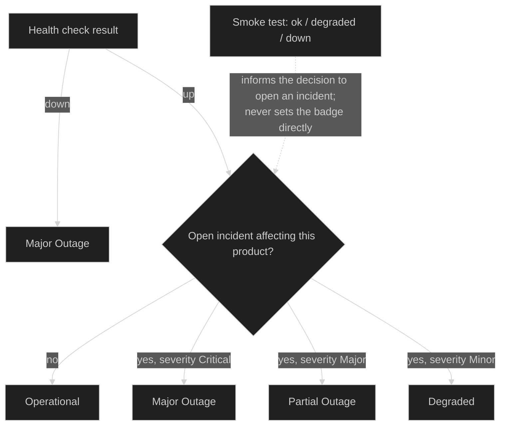

# Domain Models

Diagrams for the platform's data model. The **Licensing** section is grounded in the actual code (`EnsyInc.Enclave.Core/Models/*.cs`, `EnsyInc.Enclave.DataAccess.EF/Configuration/*Config.cs`) — field names, types, and relationships are copied from there, not the requirements docs, so they reflect what's actually built. The **Monitoring** section is design-only (from [monitoring-service.md](./monitoring-service.md)); no Monitoring code exists in this repo. See [features.md](./features.md) for the matching feature/endpoint inventory.

All Licensing entities inherit the same base fields (`Id: Guid` PK, `CreatedAt`, `UpdatedAt?`, `DeletedAt?`) and use soft delete (`DeletedAt` set, filtered out of unique indexes) rather than hard row removal.

## Licensing domain model (implemented)

### Entity relationships

Notes on relationships that don't map cleanly to plain FK cardinality:

- **Org ↔ User is bidirectional-ish but only one direction is a real FK.** `User.OrgId` is a required FK to `Org` (an org has many users). `Org.PrimaryUserId` is a separate, optional FK to `User` — nothing in the schema enforces that the primary-contact user actually belongs to that same org, or that a user is primary contact for only one org.
- **License ↔ LicenseRequest has no stored discriminator.** Whether a request is "new" or "a renewal" is inferred purely from whether `ExistingLicenseId` is null, not a stored `Type` field.
- **One active license per (org, product)** is enforced by a unique index on `(OrgId, ProductId)` filtered to non-deleted rows — not visible in a plain ER diagram, called out here instead.
- All FK relationships use `DeleteBehavior.Restrict` (no cascade deletes) and are unidirectional in EF (no inverse navigation collections configured on the "one" side).

### Status state machines

`UserRole` (`Reader` / `Admin`) is a flat classification, not a state machine, so it's omitted below.

**Product.Status** — the only status *not* gated by dedicated endpoints: `POST`/`PUT` accept a `Status` value directly (`[JsonRequired] ProductStatus Status` on both create and update requests), so any transition is possible via a plain update. `POST /products/{id}/retire` exists as a convenience action on top of that.

**Org.Status** — gated: `Status` is not present on `CreateOrgRequest`/`UpdateOrgRequest`; the only mutators are the two action endpoints below.

**User.Status** — gated similarly (`Status` isn't on `InviteUserRequest`/`UpdateUserRequest`). Note: no code path was found that moves a user from `InviteSent` to `Active` (no "accept invite" endpoint exists yet) — likely a gap to close when the invite-acceptance flow is built.

**License.Status** — fully gated by service logic, no direct status setter on any request DTO.

`LicenseStatus.Expired` exists in the enum but nothing in the current code transitions a license into it — there's no background job checking `End` against the current date.

**LicenseRequest.Status** — one-way, terminal once reviewed (`409 Conflict` if re-approved/rejected).

## Monitoring domain model (designed, not implemented)

Built from [monitoring-service.md](./monitoring-service.md) prose only — no Core models, EF entities, or controllers exist for any of this yet.

`PRODUCT }o--o{ INCIDENT` is many-to-many (an incident can affect multiple products; a product can have multiple concurrent incidents) and would need a join entity/table, e.g. `INCIDENT_PRODUCT`, not shown above for brevity. `INCIDENT` would also have a nested "timeline of updates" collection (timestamped entries), omitted from the attribute list above for the same reason.

### Incident status (standard status-page workflow)

### Public status badge derivation

Not a state machine on a stored field — a computed value, re-derived from the two live inputs each time the badge is rendered.

Exact severity → badge mapping is noted in the requirements as "finalized at implementation time" — the diagram above reflects the stated principle (liveness sets the floor, incident severity moves the needle on degraded states), not a locked-in mapping.
